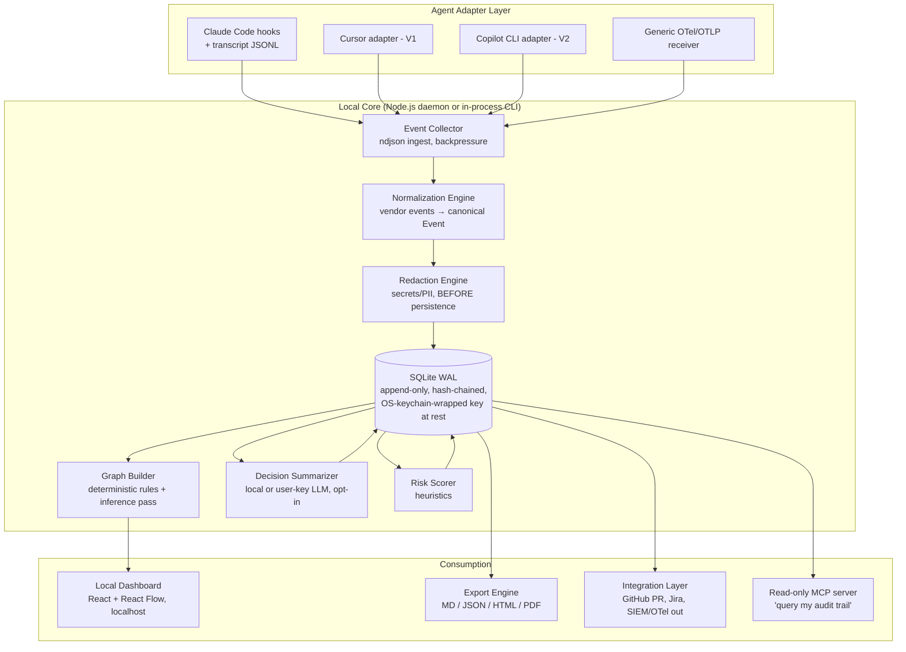

# AUDIT_AGENT_PLUGIN_PLAN.md
## Agent Audit & Workflow Trace Plugin — Implementation-Ready Plan
*Working name: **AILogTrace** ("Flight recorder for AI-assisted development")*
*Version 0.1 — July 2026*

---

## 1. One-Page Product Brief

**Product.** A local-first audit and workflow-trace plugin for AI coding agents (Claude Code first). It runs in the background via supported agent lifecycle hooks, records every prompt, tool call, file change, command, test run, approval, error, and retry, extracts a *decision log* from agent output, and renders the whole session as an interactive start-to-finish workflow graph. Exportable as Markdown/JSON/HTML/PDF audit reports.

**Problem.** AI agents now write a large share of production code, but the *process* evaporates the moment the session ends. Git captures *what* changed; nothing captures *why*, *what was tried and rejected*, *what the human approved*, or *what the agent was told*. Copilot's enterprise audit log explicitly excludes client-side prompt/session data; Cursor's advanced audit logs are Enterprise-only and cloud-bound; Langfuse/LangSmith trace telemetry but are cloud LLM-ops platforms aimed at app builders, not audit systems for the software-development workflow itself.

**Solution.** Observed-event capture (hooks + transcript parsing) → normalization → secret/PII redaction → append-only, hash-chained local store (SQLite) → graph builder → local dashboard + exportable compliance reports. Everything on-device by default; optional self-hosted team server later.

**Differentiators.**
1. Decision-and-alternatives log, not just traces — with every inferred item explicitly labeled `inferred` vs `observed`.
2. Workflow graph replay from first prompt to final output.
3. Local-first, encrypted, tamper-evident — auditable without shipping your codebase to a SaaS.
4. Compliance exports (SOC 2 / ISO 27001 / HIPAA change-control evidence, EU AI Act documentation support).
5. Agent-agnostic adapter layer (Claude Code → Cursor → Copilot CLI → OpenCode/Codex).

**Business model.** Open-source core (MIT/Apache) → paid team server (self-hosted) → enterprise compliance package.

**Primary buyer.** Engineering leadership / platform teams at regulated or AI-forward companies. Primary *user*: the individual developer (must love it or the buyer never hears about it).

**MVP.** Claude Code plugin (hooks + JSONL transcript parser) + SQLite store + `ailogtrace ui` local React dashboard with timeline, diff view, decision log, and React Flow graph + Markdown/JSON export.

---

## 2. Problem Validation (summary)

Validated pain points:

- **Traceability gap.** GitHub's own docs state the Copilot audit log "does not include client session data, such as the prompts a user sends" — enterprises must build custom capture. That is precisely this product.
- **Compliance pressure.** SOC 2 / HIPAA / ISO auditors increasingly ask "show me how this AI-generated change was reviewed and approved." Change-management evidence for AI-authored code is an unsolved, growing requirement (EU AI Act GPAI transparency obligations add to this from Aug 2025 onward).
- **Explainability & handover.** A teammate inheriting an agent-built feature has a git diff and nothing else. "Why did the agent choose library X?" is unanswerable today.
- **Reproducibility & incident forensics.** When an agent-introduced bug ships, there is no flight recorder to replay how it happened.
- **Multi-agent sprawl.** Orgs run Claude Code + Cursor + Copilot simultaneously; governance across tools is fragmented per-vendor.

Counter-evidence to respect: most individual developers do *not* feel this pain daily; the acute need is organizational. Design for developer-neutral (zero-friction, useful diff/replay for the dev) and organization-positive.

## 3. Market Gap (summary of analysis)

| Category | Examples | What they do | Gap left |
|---|---|---|---|
| LLM observability | Langfuse, LangSmith, Helicone, PromptLayer, W&B Weave, Braintrust, Arize | Traces, tokens, cost, evals; Langfuse/LangSmith already ingest Claude Code via hooks/OTel | Cloud-first; app-builder audience; no decision log, no file-change semantics, no workflow graph of a *dev session*, no compliance reports |
| Native agent logs | Claude Code OTel + hooks, Cursor history, Copilot audit log | Raw events, usage metrics, admin logs | No synthesis, no graph, no redaction pipeline, no local audit store; Copilot excludes prompts entirely |
| Session replay | Augment "Cosmos" sessions | Replayable cloud agent runs | Locked to their cloud runtime |
| Code review / DevEx analytics | PRs, DX, LinearB, Jellyfish | Outcome metrics | Blind to the in-session process |
| OTel wrappers | claude_telemetry etc. | Pipe events to Honeycomb/Datadog | Plumbing only — no semantic audit layer |

**Verdict:** telemetry plumbing is commoditized; the *semantic audit layer* (decisions, approvals, alternatives, graph, redaction, tamper-evidence, compliance export, local-first) is a real, open gap. Idea is **partially available — fresh in its specific positioning**. Window: 12–24 months before LLM-ops vendors or agent vendors bundle it.

## 4. Personas → killer feature

| Persona | Why they use it | Feature that matters most |
|---|---|---|
| Individual developer | Recall what/why after long agent sessions; debug agent misbehavior | Session timeline + diff viewer + search |
| Senior engineer | Review AI work from juniors; catch risky changes | Risk-flagged file changes + decision log |
| Solution architect | Verify agent followed intended design | Workflow graph + decision/alternatives log |
| Engineering manager | Team visibility, agent ROI | Project dashboard + agent performance metrics |
| Security auditor | Evidence trail; secret exposure detection | Immutable hash-chained log + redaction report |
| Enterprise governance / compliance | SOC 2 / ISO / HIPAA / AI Act evidence | Compliance report generator + retention policies |
| AI platform team | Standardize governance across agents | Adapter layer + OTel export + self-hosted server |
| Client delivery / consultants | Prove work performed; deliverable documentation | Branded PDF/HTML audit report export |

## 5. Feature Roadmap

### MVP (Claude Code only, local only)
- Hook-based session recording (SessionStart/UserPromptSubmit/PreToolUse/PostToolUse/PermissionRequest/Stop/SubagentStop)
- Transcript JSONL ingestion (assistant text, visible reasoning summaries — never raw private CoT)
- Prompt/response timeline; tool-call, file-change (with before/after diff), command, test-result, error/retry tracking
- Approval/rejection capture from permission events
- Secret redaction (regex + entropy, pre-persistence)
- SQLite append-only store with hash chain
- Local dashboard: timeline, diff viewer, search, React Flow workflow graph
- Export: Markdown session report + JSON

### V1
- LLM-generated decision log (labeled `inferred`, with source-event citations) and per-session executive summary
- Replay mode (step through the session)
- Risk scoring for changes (heuristics: touched auth/crypto/CI files, large diffs, failed-then-forced tests, skipped approvals)
- Git/PR linkage (commit ↔ session), GitHub PR comment with session summary link
- HTML/PDF export; project-level dashboards; retention policies; PII redaction (NER)
- Second adapter (Cursor via its hooks/history, or OpenCode/Codex CLI)

### Enterprise
- Self-hosted team server (Postgres), RBAC, SSO/SCIM
- Compliance report templates (SOC 2 CC8.1 change mgmt, ISO 27001 A.8, HIPAA §164.312(b), EU AI Act annex-style documentation)
- Immutable/WORM storage option, signed exports, external timestamping
- Jira/Azure DevOps linkage; SIEM/OTel forwarding; org-wide redaction policy management
- Cross-agent normalization (Copilot CLI, Cursor, Continue), fleet analytics

## 6. Workflow Graph Model

### Node types
`UserPrompt, AgentPlan, AgentDecision, ToolCall, FileRead, FileWrite, CommandRun, TestRun, Error, Retry, Approval, Rejection, SubagentRun, ExternalApiCall, GitCommit, PullRequest, FinalOutput`

Node metadata (all nodes): `id, sessionId, type, ts, durationMs, label, summary, sourceEventIds[], provenance: "observed" | "inferred", redactionsApplied: int, riskScore?: 0–100`

### Edge types
`triggered, responded_to, modified, depended_on, failed_then_retried, approved, rejected, generated, verified_by, part_of`

Edge metadata: `id, from, to, type, ts, confidence (1.0 for observed causality, <1 for inferred), note?`

### Construction rules (deterministic first, inference second)
1. Hook events give guaranteed ordering + causality within a tool cycle: `UserPrompt --triggered--> ToolCall --modified--> FileWrite`.
2. Test/command outcomes: non-zero exit → `Error`; same-target subsequent run → `failed_then_retried` edge.
3. Permission events → `Approval`/`Rejection` nodes with `approved/rejected` edges to the gated ToolCall.
4. `AgentDecision`/`AgentPlan` nodes come from LLM summarization of assistant messages — always `provenance: inferred`, always citing `sourceEventIds`.
5. Collapse noise: consecutive FileReads group into one expandable node; heartbeat events dropped.

### Rendering
- **Interactive dashboard:** React Flow (custom node components, minimap, collapse/expand groups) + `elkjs` layered layout for left-to-right DAGs. Best fit: controlled interactivity, virtualization for large graphs.
- **Static exports:** Mermaid `flowchart LR` embedded in Markdown/HTML reports (universally renderable in GitHub/GitLab).
- Cytoscape.js is the fallback if graphs exceed ~2–3k nodes; D3 only for bespoke timeline visuals; Graphviz for server-side PNG/SVG in PDFs.

### Example workflow graph (Mermaid)

```mermaid
flowchart LR
  UP1[UserPrompt:<br/>"Add rate limiting to API"] -->|triggered| AP1[AgentPlan:<br/>middleware approach]
  AP1 -->|generated| AD1{AgentDecision:<br/>token bucket vs sliding window}
  AD1 -->|rejected| ALT1[Alt: sliding window<br/>reason: memory cost]:::rej
  AD1 -->|triggered| FR1[FileRead: api/server.ts]
  FR1 -->|depended_on| FW1[FileWrite: api/ratelimit.ts]
  FW1 -->|verified_by| TR1[TestRun: npm test]
  TR1 -->|failed_then_retried| ER1[Error: 2 tests failing]:::err
  ER1 -->|triggered| FW2[FileWrite: fix redis mock]
  FW2 -->|verified_by| TR2[TestRun: pass 34/34]:::ok
  TR2 -->|triggered| APR1[Approval: user approved<br/>git commit]:::ok
  APR1 -->|generated| GC1[GitCommit: a1b2c3d]
  GC1 -->|generated| FO1[FinalOutput:<br/>rate limiting shipped]
  classDef err fill:#7a2626,color:#fff
  classDef ok fill:#1f6f43,color:#fff
  classDef rej stroke-dasharray: 5 5
```

## 7. Data Model

Entities: **Project, Session, Event (base), Message, Decision, ToolCall, FileChange, CommandExecution, TestResult, ApprovalRecord, GraphNode, GraphEdge, RiskFlag, RedactionRule, RedactionAudit, ExportReport, Agent(adapter)**.

Storage: single SQLite db per machine (`~/.ailogtrace/audit.db`), WAL mode; `events` is append-only with `prev_hash`/`row_hash` columns (SHA-256 chain). Graph tables are derived/rebuildable from events. Enterprise: same schema on Postgres.

### Event (base envelope) — JSON Schema (abridged)

```json
{
  "$id": "https://ailogtrace.dev/schemas/event.json",
  "type": "object",
  "required": ["id", "sessionId", "ts", "source", "kind", "payload", "prevHash", "hash"],
  "properties": {
    "id": { "type": "string", "format": "uuid" },
    "sessionId": { "type": "string" },
    "seq": { "type": "integer" },
    "ts": { "type": "string", "format": "date-time" },
    "source": { "enum": ["hook", "transcript", "git", "adapter", "user", "system"] },
    "kind": { "enum": ["session_start", "session_end", "user_prompt", "agent_message",
      "tool_call_start", "tool_call_end", "file_read", "file_change", "command_run",
      "test_result", "permission_request", "approval", "rejection", "error", "retry",
      "subagent_start", "subagent_stop", "git_commit", "external_api_call", "final_output"] },
    "agent": { "type": "object", "properties": {
      "name": {"type": "string"}, "version": {"type": "string"}, "model": {"type": "string"} } },
    "payload": { "type": "object" },
    "redactions": { "type": "array", "items": { "type": "object", "properties": {
      "ruleId": {"type": "string"}, "field": {"type": "string"}, "count": {"type": "integer"} } } },
    "provenance": { "enum": ["observed", "inferred"], "default": "observed" },
    "prevHash": { "type": "string" },
    "hash": { "type": "string", "description": "sha256(prevHash + canonical(event))" }
  }
}
```

### Sample event JSON (file change, post-redaction)

```json
{
  "id": "7f9c2a1e-3b4d-4c8a-9e21-aa10f2d4b901",
  "sessionId": "sess_2026-07-02_0932_acme-api",
  "seq": 143,
  "ts": "2026-07-02T09:47:12.480Z",
  "source": "hook",
  "kind": "file_change",
  "agent": { "name": "claude-code", "version": "2.1.14", "model": "claude-opus-4-8" },
  "payload": {
    "toolCallId": "tc_0x88",
    "path": "src/api/ratelimit.ts",
    "changeType": "create",
    "linesAdded": 84,
    "linesRemoved": 0,
    "diffRef": "blob:sha256:9c1e...",
    "language": "typescript",
    "gitBranch": "feat/rate-limit"
  },
  "redactions": [
    { "ruleId": "builtin.redis-url", "field": "payload.diff", "count": 1 }
  ],
  "provenance": "observed",
  "prevHash": "e3b0c44298fc1c149afbf4c8996fb92427ae41e4649b934ca495991b7852b855",
  "hash": "5a1c9d0f6e2b7c4a8d3f1e0b9a6c5d4e3f2a1b0c9d8e7f6a5b4c3d2e1f0a9b8c"
}
```

### Decision — schema + sample decision log

```json
{
  "id": "dec_017",
  "sessionId": "sess_2026-07-02_0932_acme-api",
  "ts": "2026-07-02T09:41:03Z",
  "title": "Rate limiter algorithm: token bucket",
  "chosen": "Token bucket via rate-limiter-flexible (Redis-backed)",
  "alternatives": [
    { "option": "Sliding window log", "outcome": "rejected", "reason": "O(n) memory per client at target RPS" },
    { "option": "nginx-level limiting", "outcome": "rejected", "reason": "user requires per-API-key limits, app-layer context needed" }
  ],
  "rationaleSummary": "Agent weighed memory footprint and per-key granularity; user confirmed Redis already in stack.",
  "provenance": "inferred",
  "confidence": 0.86,
  "sourceEventIds": ["evt_129", "evt_131", "evt_134"],
  "linkedGraphNodeId": "node_AD1"
}
```

Other core tables (abridged): `sessions(id, projectId, startedAt, endedAt, agent, model, gitBranch, gitStartSha, gitEndSha, summary, status)`, `tool_calls(id, sessionId, tool, inputRedacted, outputRef, startTs, endTs, exitStatus, permissionState)`, `file_changes`, `command_executions`, `test_results(passed, failed, skipped, framework, rawRef)`, `risk_flags(id, sessionId, targetType, targetId, rule, severity, score, explanation)`, `redaction_rules(id, name, pattern|detector, action: mask|drop|hash, scope, builtin?)`, `graph_nodes/graph_edges`, `export_reports(id, sessionIds[], format, createdAt, signature)`.

## 8. Architecture



**Form factor decision (MVP): Claude Code plugin + npm CLI hybrid.**
- Distribution: a Claude Code plugin (hooks config + commands) that shells to a single `ailogtrace` binary/CLI; `ailogtrace ui` serves the dashboard on localhost.
- Why not VS Code extension first: ties you to one editor; Claude Code runs in terminals/CI too.
- Why not MCP-server-only: MCP gives the agent tools, not lifecycle visibility; hooks are the reliable event source. (Ship the read-only MCP server as a bonus — "ask Claude about its own audit trail" is a great demo.)
- Why not Electron/Tauri desktop app: unnecessary weight for MVP; localhost web UI is enough. Tauri is the V1+ option if a packaged app is demanded.
- Hooks must be **non-blocking**: hook script appends ndjson to a spool file and exits <10ms; the collector tails the spool asynchronously. Never make the agent wait on the audit pipeline.

## 9. Tech Stack

| Layer | MVP | Enterprise scale |
|---|---|---|
| Language | TypeScript / Node.js 22 (single language across hook, CLI, UI) | Same core; consider Go for high-throughput collector |
| Storage | SQLite (WAL) + content-addressed blob dir for diffs | PostgreSQL + object storage; DuckDB for analytics queries |
| UI | React 18 + Vite + Tailwind + React Flow + elkjs + shiki (diff highlight) | Same, plus multi-tenant server |
| API | Local REST (Fastify) — GraphQL is overkill for MVP | REST + optional GraphQL for dashboard federation |
| Graph static export | Mermaid | Graphviz server-side for PDF |
| Telemetry interop | OTLP/JSON receiver + exporter | Full OTel semantic-convention mapping |
| Packaging | npm package + Claude Code plugin manifest | + Docker (self-hosted server), Helm |
| Secret detection | Regex ruleset (gitleaks-style) + Shannon entropy | + org-managed rules, NER-based PII (e.g., local presidio-like pass) |
| Crypto | SHA-256 hash chain; SQLCipher or file-level AES-256-GCM, key in OS keychain | + signed exports (Ed25519), RFC 3161 timestamping option |

.NET: not recommended — the entire agent-plugin ecosystem (hooks, MCP, npm distribution) is JS-native; .NET adds friction without benefit here.

## 10. Security, Privacy, Compliance

**Never capture (hard denylist):**
- Raw private chain-of-thought (only agent-emitted visible text/summaries; the plugin only reads what the vendor already exposes in transcripts/hooks)
- Contents of `.env`, key files (`*.pem`, `*.p12`, `id_rsa*`), keychain/credential stores, browser profiles
- Anything matching secret detectors — masked *before* first write, with a `RedactionAudit` record (rule, count, location — never the value)
- Clipboard, screen, keystrokes, or any channel outside declared hooks/logs/APIs
- Files matched by user's `.ailogtraceignore` / `.gitignore`-style opt-outs

**Controls:**
- Workspace-level consent: recording starts only after explicit `ailogtrace init` in a project; visible status indicator; `ailogtrace pause/off` honored instantly; per-session "record: off" flag from hook config.
- Encryption at rest (AES-256-GCM or SQLCipher), key in OS keychain. Local-only by default; zero network egress in MVP (verifiable — publish egress policy and make the code open source).
- Tamper evidence: per-event hash chain + periodic signed checkpoints; `ailogtrace verify` recomputes the chain. Honest claim: *tamper-evident*, not tamper-*proof* (local attacker with the key can rewrite; true immutability needs the enterprise WORM/server tier).
- Retention: per-project TTL policies; crypto-shredding (drop per-session data keys) for deletion compliance (GDPR erasure).
- RBAC/SSO/export permissions: enterprise server tier only; single-user local mode = OS user is the boundary.
- Risks acknowledged: an audit store of prompts + diffs is itself a high-value target — this is the strongest argument for local-first and for aggressive default redaction; also treat *summaries* as sensitive (they can leak business context).

## 11. Feasibility — hard questions, honest answers

- **Can Claude Code expose enough?** Yes for actions: hooks cover session/prompt/tool/permission/subagent lifecycle, and transcript JSONL gives messages. **No for internal deliberation** — you observe behavior and stated reasoning, not cognition. Frame the product as *behavioral* audit; never claim to capture "the AI's true reasoning."
- **Reliably capture all decisions?** No. Decisions are inferred from text. Mitigate: provenance labels, confidence scores, source-event citations, and a "decision checkpoint" convention (a hook/command that asks the agent to emit structured decision records at key moments).
- **Misleading audit trails?** Biggest product risk. An audit tool that hallucinates is worse than none. Mitigations: deterministic layer is ground truth; inferred layer is visually distinct; exports include a methodology appendix; summarizer must cite events or the claim is dropped.
- **Storage blow-up?** Sessions can emit tens of MB (diffs, outputs). Mitigate: content-addressed dedupe, zstd compression, truncate large tool outputs with head/tail retention, TTL policies. Budget target: <50 MB per heavy session.
- **Performance?** Hooks append-and-exit (<10 ms); all processing async. Non-negotiable requirement.
- **Multi-agent?** Real but deferred. Canonical event schema from day 1; adapters later. Cursor/Copilot expose far less than Claude Code — expect fidelity tiers, and say so in the UI.
- **Will developers use it?** Only if it's zero-config and gives *them* value (searchable "what did the agent do to my repo last Tuesday"). If it feels like surveillance, adoption dies — developer-controlled local mode must remain free and genuinely useful forever.
- **Will enterprises pay?** Plausible (compliance budgets exist; Copilot's audit gap is documented), but sales cycles are long and platform vendors may bundle "good enough" logging within 1–2 years. Speed and open-source distribution are the moat.

## 12. Monetization

| Tier | Offer | Price (initial hypothesis) |
|---|---|---|
| OSS Core | Local recording, dashboard, graph, MD/JSON export | Free forever |
| Pro (individual) | PDF/HTML branded reports, replay mode, multi-project search, priority support | $9–15 /user/mo |
| Team (self-hosted server) | Shared server, project dashboards, PR integration, retention policies | $25–39 /user/mo |
| Enterprise | RBAC/SSO/SCIM, compliance report packs, WORM/signing, SIEM export, fleet analytics, support SLA | $60k+ /yr platform fee or ~$60–90 /user/mo |
| Services | Audit-report generation for consultancies/agencies (white-label) | Per-engagement |

Consultants/agencies are an underrated early segment: they can *bill* with the deliverable ("here is the audit trail of the work you paid for").

## 13. Positioning

**Primary: "The flight recorder for AI-assisted development."** Concrete, implies safety/forensics without implying surveillance, and explains itself in one sentence.
Secondary framings: "Git history for AI agent decisions" (great for dev marketing), "Observability layer for AI coding agents" (avoid as primary — collides with Langfuse/LangSmith category).
Tagline candidates: *"Every decision. Every diff. On the record."* / *"Know what your agent did, and why."*

**Name: AILogTrace** (verified July 2026: `ailogtrace` free on npm, PyPI, and as a GitHub org). Clear and self-explanatory, but descriptive/generic — trademark protection and search discoverability will be weak, so let the "flight recorder" tagline carry the positioning. Runners-up (also verified free): **FlightRec** (embodies the positioning, strong CLI verb) and **AgentWitness** (audit-flavored, slightly surveillance-adjacent tone). Ruled out after availability checks: `agenttrace`, `traceloom` (npm-taken, Playwright tool), `agentledger` (active npm product — and a competitor to track: agent action tracking with budgets/kill-switch, cloud dashboard), `attestor`/`agentrail`/`agentscribe` (npm-taken), `tracedeck`/`auditrail`/`sessionscribe` (GitHub org taken). Before committing: verify domains (ailogtrace.dev/.io) and run a basic trademark search.

## 14. Scores & Recommendation

| Dimension | Score /10 | Note |
|---|---|---|
| Market need | 8 | Compliance + explainability gap is real and documented |
| Freshness | 6 | Plumbing exists (Langfuse/OTel); semantic audit layer is the fresh part |
| Technical feasibility | 8 (Claude Code) / 5 (all agents) | Hooks make CC-first very buildable |
| Enterprise value | 8 | Direct fit to SOC 2/HIPAA/AI-Act evidence needs |
| Developer adoption | 5 | Real risk: perceived surveillance + "nice to have" for individuals |
| Monetization potential | 7 | Enterprise tier credible; long sales cycle |
| Build complexity | 6 (MVP) / 8 (enterprise) | MVP is a focused 4–8 week build |
| Risk level | 6 | Platform bundling risk + inferred-decision credibility risk |

**GO — conditional.** Build it, open-source first, Claude Code only, local-only, with the deterministic capture layer as the hero and LLM inference as a clearly-labeled add-on. Avoid: multi-agent support in MVP, any cloud component in MVP, any claim of capturing "reasoning," Electron app, GraphQL, building your own diff/graph libs.

## 15. MVP Backlog

**Epic A — Capture (week 1–2)**
- A1 As a dev, `ailogtrace init` installs Claude Code hooks into my project so sessions record automatically. *(AC: all 8 hook events spooled; agent latency impact <10 ms/hook.)*
- A2 As a dev, my transcript JSONL is ingested and linked to hook events by session id.
- A3 As a dev, file edits store unified diffs (content-addressed, compressed).
- A4 As a dev, command runs store exit codes and truncated output; test frameworks (jest/vitest/pytest) are parsed into pass/fail counts.
- A5 As a dev, permission prompts are recorded as Approval/Rejection events.

**Epic B — Safety (week 2)**
- B1 Secrets are masked before persistence (gitleaks-pattern set + entropy), with redaction-audit records. *(AC: seeded-secrets test corpus → 0 plaintext hits in db.)*
- B2 `.ailogtraceignore` excludes files/paths from capture.
- B3 Event hash chain + `ailogtrace verify`.
- B4 DB encrypted at rest; key in OS keychain; `ailogtrace off` stops capture instantly.

**Epic C — Store & normalize (week 2–3)**
- C1 Canonical Event schema + SQLite migrations; append-only enforcement.
- C2 Graph builder: deterministic node/edge derivation with grouping/collapse rules.

**Epic D — Dashboard (week 3–5)**
- D1 Session list + timeline view (prompts, tools, files, commands, errors).
- D2 Diff viewer with syntax highlighting.
- D3 React Flow workflow graph with elk layout, node inspector, observed/inferred styling.
- D4 Full-text search across sessions (SQLite FTS5).

**Epic E — Reports (week 5–6)**
- E1 Markdown session report (summary, timeline, decisions-if-enabled, diffs, redaction appendix, methodology note).
- E2 JSON export of full session; Mermaid graph embedded in Markdown.

**Epic F — Inference (optional flag, week 6)**
- F1 Opt-in decision summarizer using user's own API key or local model; every Decision cites sourceEventIds; UI labels `inferred`.

## 16. Risk Register

| # | Risk | L | I | Mitigation |
|---|---|---|---|---|
| R1 | Anthropic/Cursor bundle equivalent auditing | M | H | Ship fast; own multi-agent + compliance layer vendors won't build; OSS community moat |
| R2 | Hook API churn breaks capture | M | M | Adapter isolation; version-pinned contract tests; transcript parser as fallback source |
| R3 | Inferred decisions wrong → credibility loss | M | H | Provenance labels, citations, confidence, deterministic core as default view |
| R4 | Secret leakage into audit store | L | Crit | Pre-persistence redaction, seeded-secret CI tests, encrypted store, denylist |
| R5 | Perceived as employee surveillance | M | H | Local-first default, dev owns data, transparent OSS code, no keystroke/screen capture ever |
| R6 | Storage bloat kills adoption | M | M | Dedupe, compression, truncation, TTL |
| R7 | LLM-ops incumbents pivot down-market | M | M | Differentiate on local-first + compliance artifacts, not tracing |
| R8 | Enterprise sales stall (no design partner) | M | H | Recruit 2–3 design partners (regulated startups, consultancies) in first 60 days |
| R9 | Audit store itself becomes attack target | L | H | Encryption, no egress, crypto-shredding, minimal retention defaults |

## 17. 30-Day Execution Plan

**Week 1 — Spike & skeleton**
- D1–2: Instrument all Claude Code hook events; dump raw payloads; verify transcript JSONL linkage and coverage against a real coding session.
- D3–4: Canonical Event schema, SQLite store, hash chain, spool-file ingestion.
- D5: Redaction pass v0 (regex set) wired *before* persistence; seeded-secret test.
- **Gate:** replay a real session's events from db and confirm completeness vs. what you saw in the terminal. If coverage <90% of meaningful actions, stop and fix capture before building anything else.

**Week 2 — Graph + CLI**
- Deterministic graph builder; `ailogtrace init/status/verify/export` CLI; Markdown export with Mermaid graph.
- Dogfood daily on your own Claude Code work.

**Week 3 — Dashboard**
- Fastify local API; React dashboard: session list, timeline, diff viewer.
- React Flow graph view with elk layout.

**Week 4 — Polish + release**
- FTS search, `.ailogtraceignore`, encryption at rest, docs, demo GIF/video.
- Package as Claude Code plugin + npm; publish OSS repo; post to r/ClaudeAI, HN "Show HN", Anthropic Discord.
- **Success criteria (day 30):** 10 external users ran ≥1 real session; ≥1 person exported a report they actually shared; capture overhead unmeasurable in agent UX; zero secret-leak reports.

Days 31–60 preview: decision summarizer (opt-in), replay mode, PDF export, 2–3 design-partner interviews for the compliance tier.

## 18. Go/No-Go

**GO**, as open source, Claude Code-first, local-first. The deterministic audit layer is buildable in 30 days by one senior engineer, the compliance gap is documented in vendor docs themselves, and the main risks (bundling, credibility) are best countered by shipping early and being transparent. Kill criteria: if after 90 days of OSS availability there is no organic pull (stars, issues, unsolicited "can we run this for the team?" requests), treat it as a portfolio piece, not a company.
